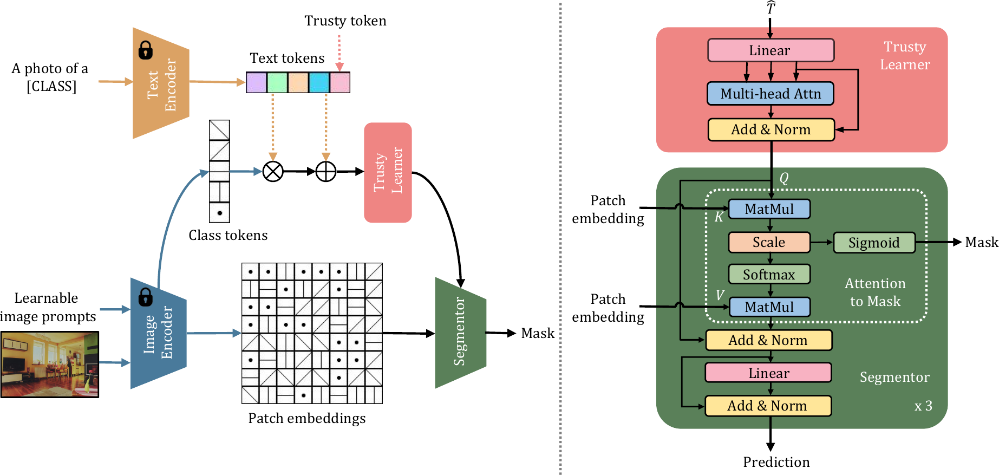

# TagCLIP
This is the official repo of TagCLIP: Improving Discrimination Ability of Zero-Shot Semantic Segmentation

## Overview
Contrastive Language-Image Pre-training (CLIP) has recently shown great promise in pixel-level zero-shot learning tasks. However, existing approaches utilizing CLIP's text and patch embeddings to generate semantic masks often misidentify input pixels from unseen classes, leading to confusion between novel classes and semantically similar ones. In this work, we propose a novel approach, **TagCLIP**~(**T**rusty-**a**ware **g**uided CLIP), to address this issue. We disentangle the ill-posed optimization problem into two parallel processes: semantic matching performed individually and reliability judgment for improving discrimination ability. Building on the idea of special tokens in language modeling representing sentence-level embeddings, we introduce a trusty token that enables distinguishing novel classes from known ones in prediction. To evaluate our approach, we conduct experiments on two benchmark datasets, PASCAL VOC 2012 and COCO-Stuff 164K. Our results show that TagCLIP improves the Intersection over Union (IoU) of unseen classes by 7.4% and 1.7%, respectively, with negligible overheads.



## Preparation
### Environment
```bash
pip install -r requirements.txt
```
### Dataset
The data preparation document is [here](https://github.com/open-mmlab/mmsegmentation/blob/master/docs/en/dataset_prepare.md)

### Pretrained CLIP model
```
mkdir pretrained & cd pretrained
wget https://openaipublic.azureedge.net/clip/models/5806e77cd80f8b59890b7e101eabd078d9fb84e6937f9e85e4ecb61988df416f/ViT-B-16.pt
```

## Train
### Inductive
```bash
dataset=voc12 # support voc12, coco
# multi gpu training
bash src/dist_train.sh src/configs/$dataset/inductive.py output/$dataset/inductive
# single gpu training
python src/train.py src/configs/$dataset/inductive.py --work-dir=output/$dataset/inductive
```
### Transductive
```bash
# coco multi gpu training
bash src/dist_train.sh src/configs/coco/transductive.py output/coco/transductive --load-from=output/coco/inductive/iter_40000.pth
# voc12 multi gpu training
bash src/dist_train.sh src/configs/voc12/transductive.py output/voc12/transductive --load-from=output/voc12/transductive/iter_10000.pth
# coco single gpu training
python src/train.py src/configs/coco/transductive.py output/coco/transductive --load-from=output/coco/inductive/iter_40000.pth
# voc single gpu training
python src/train.py src/configs/voc12/transductive.py output/voc12/transductive --load-from=output/voc12/transductive/iter_10000.pth
```

## Inference
```bash
# intra dataset
python src/test.py $config $ckpt --eval=mIoU
# cross dataset
python src/test.py src/configs/cross_dataset/coco-to-voc.py output/coco/inductive/iter_80000.pth --eval=mIoU
python src/test.py src/configs/cross_dataset/coco-to-context.py output/coco/inductive/iter_80000.pth --eval=mIoU
```

## Acknowledgement
Our work is closely related to the following assets that inspire our implementation. We gratefully thank the authors. 

 - [CLIP](https://github.com/openai/CLIP)
 - [Maskformer](https://bowenc0221.github.io/maskformer)
 - [Zegformer](https://github.com/dingjiansw101/ZegFormer)
 - [zsseg](https://github.com/MendelXu/zsseg.baseline)
 - [MaskCLIP](https://github.com/chongzhou96/MaskCLIP)
 - [SegViT](https://github.com/zbwxp/SegVit)
 - [ZegCLIP](https://github.com/ZiqinZhou66/ZegCLIP)

## Citation
```
If you find this project useful, please consider citing:
@misc{tagclip,
      title={TagCLIP: Improving Discrimination Ability of Open-Vocabulary Semantic Segmentation}, 
      author={Jingyao Li and Pengguang Chen and Shengju Qian and Jiaya Jia},
      year={2023},
      eprint={2304.07547},
      archivePrefix={arXiv},
      primaryClass={cs.CV},
      url={https://arxiv.org/abs/2304.07547}, 
}
```